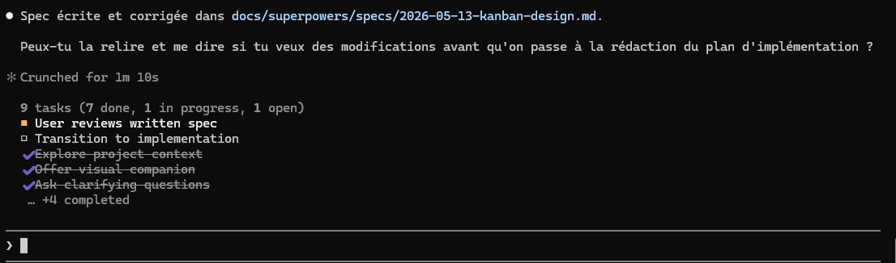
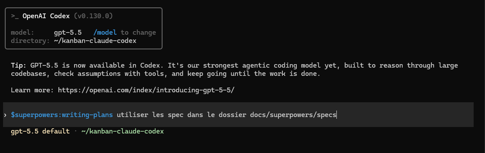
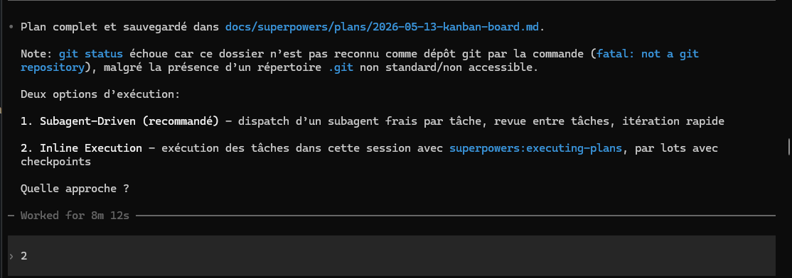
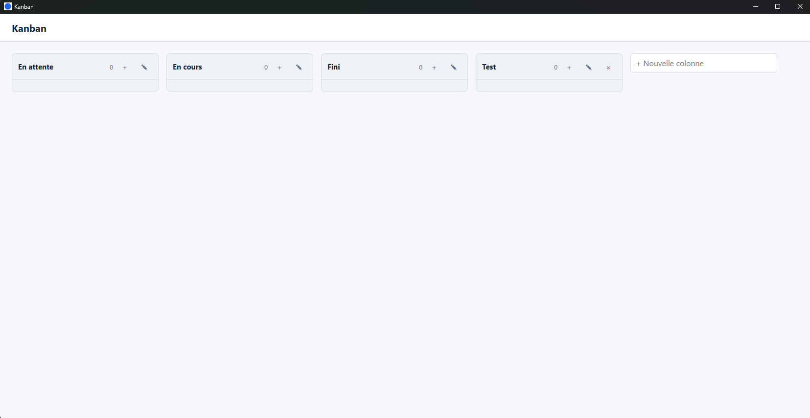
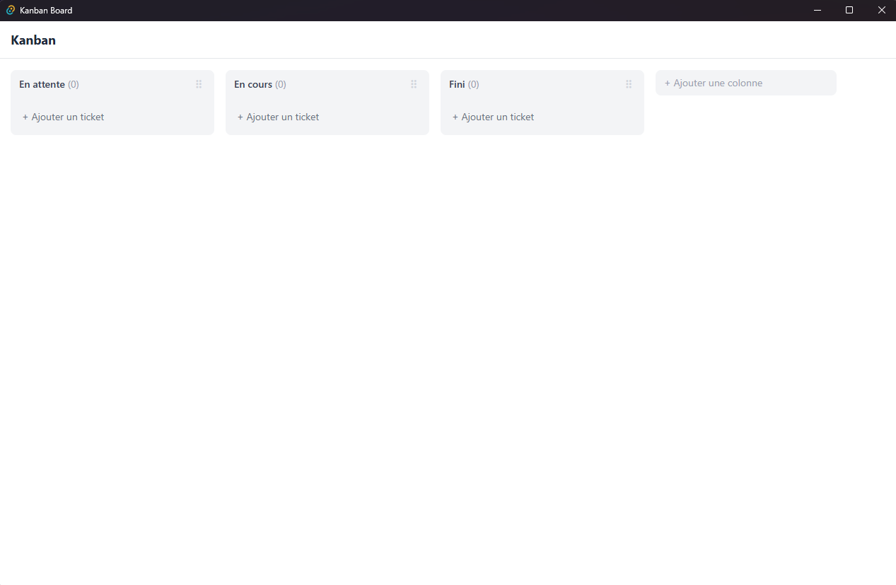
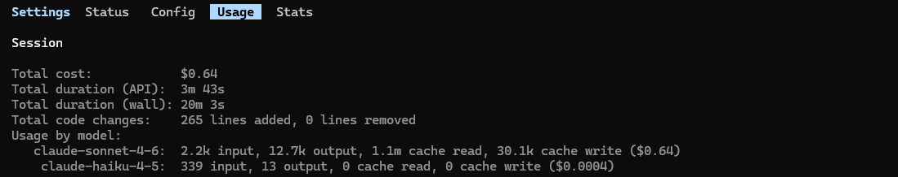
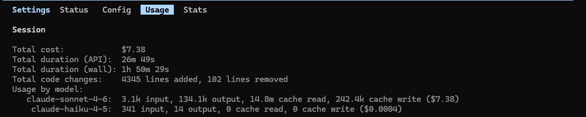

## Le problème de quota

Sur des tâches simples, le quota de cinq heures de Claude Code Pro tient largement.

Mais dès qu'on travaille sur une fonctionnalité plus complète, avec de la clarification, des specs, et plusieurs itérations de code, Claude Code peut consommer beaucoup de tokens assez rapidement.

C’est encore plus vrai avec des workflows structurés comme Superpower, qui poussent Claude Code à poser des questions, clarifier le besoin, générer des specs, puis préparer un plan. Cette méthode est puissante, mais elle consomme aussi beaucoup de contexte.

> **Superpower** est un skill pour Claude Code qui impose une méthodologie en trois temps : clarification du besoin, écriture des specs, puis plan d'exécution. C'est ce workflow que j'utilise comme base dans cet article.

Dans mon cas, il m’arrive d’atteindre 100 % de quota en moins de deux heures.

## Pourquoi Codex

Je me suis abonné à Codex Pro en plus de Claude Pro pour plusieurs raisons :

- éviter de dépendre d’un seul agent de coding
- tester Codex sur des tâches longues de génération et de modification de code
- utiliser Codex comme outil de contre-relecture.

Mon idée n’est pas de remplacer Claude Code par Codex, mais plutôt de les utiliser ensemble, chacun sur une partie différente du travail.

## Claude pour réfléchir, Codex pour exécuter

Beaucoup de personnes évoquent ce concept : “Claude for thinking, Codex for execution”. Je ne cherche pas ici à donner mon avis personnel à propos de ce principe. Je l’utilise simplement comme une façon pratique de répartir les tâches pour préserver mon quota Claude Code.

L'idée est simple : je garde Claude Code sur les étapes suivantes :

- brainstorming
- questions de clarification
- écriture des specs

Les specs seront sous forme de fichier md pour que Codex puisse les consulter, ensuite il va effectuer les tâches plus mécaniques et coûteuses, c'est-à-dire :

- écriture du plan d’exécution
- génération de code

En résumé : Claude définit les specs, puis Codex prend le relais pour la partie exécutive.

## Exemple concret : une app Kanban

Pour ce test, j’utilise :

- Claude Code
- Codex
- Superpower

Pour montrer comment je répartis les tâches entre Claude Code et Codex, je vais monter une petite application de ticketing sous forme de Kanban.

Je commence dans la session Claude Code avec ceci :

```txt
/superpowers:brainstorming
# Spec fonctionnelle — Kanban Board

Application Tauri 2 (Rust backend) + React + TypeScript (Vite frontend)
compatible Windows, Linux et macOS

## Board

- Affichage en colonnes horizontales avec scroll horizontal si nécessaire
- Trois colonnes par défaut au premier lancement : **En attente**, **En cours**, **Fini**

## Colonnes

- Créer une colonne additionnelle en saisissant un nom
- Renommer une colonne (y compris les colonnes par défaut)
- Réordonner les colonnes par drag & drop
- Supprimer une colonne additionnelle (avec confirmation) — les colonnes par défaut ne sont pas supprimables
- La suppression d'une colonne supprime tous ses tickets

## Tickets

- Créer un ticket dans une colonne avec un **titre** (obligatoire) et une **description** (optionnelle)
- Éditer le titre et la description d'un ticket existant
- Déplacer un ticket vers une autre colonne par drag & drop
- Réordonner les tickets dans une colonne par drag & drop
- Supprimer un ticket (avec confirmation)

## Persistance
- Toutes les données (colonnes, tickets, ordres) sont sauvegardées localement dans SQLite
- Les données sont conservées entre les sessions
```

La première étape est le brainstorming.

En gros, Superpower va obliger Claude Code à me poser une série de questions additionnelles pour générer des specs plus précises.

Une fois que les specs sont générées, Claude Code me demande si je valide et si je donne le go pour passer à l’écriture du plan d’exécution.



Mais au lieu de demander à Claude de continuer, je vais dans ma session Codex et je lui demande de prendre le relais.



Codex utilise alors les specs générées par Claude pour écrire le plan d’exécution.

Une fois terminé, Codex me demande à son tour si je valide le plan et si je veux passer à l’exécution.



## Répartition des tâches

Voici le récapitulatif des étapes et de l’outil qui les a effectuées :

| Étape              | Outil utilisé |
| ------------------ | ------------- |
| Brainstorming      | Claude Code   |
| Écriture des specs | Claude Code   |
| Écriture du plan   | Codex         |
| Exécution du plan  | Codex         |

Ce découpage n’est pas parfait ni universel.

Mais dans mon cas, il correspond bien à ma façon d’utiliser ces outils : Claude Code pour clarifier et structurer le besoin, Codex pour prendre le relais une fois que le besoin est assez clair.

En parallèle, je lance une autre session Claude Code qui réalise toute l’application sans déléguer à Codex. L’objectif est de comparer grossièrement la consommation entre les deux approches.

## Résultat obtenu

Voici à quoi ressemblent les deux applications kanban :




Elles sont légèrement différentes mais répondent bien aux fonctionnalités demandées.

### Tokens consommés

Voici le nombre de tokens utilisés par Claude Code dans le scénario Claude Code + Codex (7% de quota Claude):

Voici le nombre de tokens utilisés par Codex dans le même scénario (28% de quota Codex) :

```
{
  "input_tokens": 7006267,
  "cached_input_tokens": 6740480,
  "output_tokens": 56038,
  "reasoning_output_tokens": 5069,
  "total_tokens": 7062305
}
```

> Codex cli ne possède pas de commande built-in pour afficher l'usage des tokens

Et voici les résultats de l'autre test pour la même application, réalisé uniquement avec Claude Code dans une session séparée :


> Claude a visiblement consommé plus de tokens au total, environ 50% de quota.

Voici le tableau comparatif des consommations de tokens :

| Scénario            | Claude Code | Codex | Objectif                      |
| ------------------- | ----------- | ----- | ----------------------------- |
| Claude Code + Codex | 5%          | 30%   | Déplacer la charge vers Codex |
| Claude Code         | 50%         | —     | Mesurer la consommation seule |

Codex a pris en charge la majorité du volume — mais son quota est séparé et n'affecte pas le reset de Claude.

## Ce qui a bien marché

Mon objectif initial a plutôt bien fonctionné : en répartissant les tâches entre les deux agents de coding, je n’ai plus besoin d’attendre le reset des sessions aussi souvent.

Comme les deux agents travaillaient dans le même workspace, cette méthode permettait aussi de lancer des reviews croisées : je pouvais demander à l’un de relire les specs ou le travail produit par l’autre.

Ce workflow n’est pas une méthode universelle, mais il répond bien à un cas précis : continuer à avancer sur de longues sessions sans bloquer sur le quota Claude Code.

## Les limites de cette méthode

D’abord, elle ajoute de la complexité : il faut payer un outil en plus, passer d’un outil à l’autre, transférer les specs, vérifier que Codex comprend bien le contexte, puis contrôler le résultat.

Ensuite, elle oblige à garder des traces écrites. Sans specs, plan ou notes suffisamment claires, les deux agents ne peuvent pas vraiment collaborer efficacement.

Enfin, cette méthode n’est probablement pas nécessaire pour les petites tâches. Pour une correction rapide ou une petite fonctionnalité, rester uniquement dans Claude Code est souvent plus simple.

## Conclusion

Ce workflow Claude Code + Codex n’a pas pour objectif de prouver qu’un outil est meilleur que l’autre. Il répond surtout à un problème très concret : préserver le quota Claude Code pendant les longues sessions de développement, en déplaçant une partie de la charge hors de Claude Code.

Mais ce type de workflow soulève quelque chose de plus intéressant : on commence à travailler avec plusieurs agents comme on travaille avec une équipe. Chaque agent a ses forces, ses faiblesses et sa façon d'interpréter. Les faire collaborer — ou mieux, se contredire — devient une compétence à part entière.

Ma méthode est encore loin d'être fluide. Passer d'un agent à l'autre demande trop d'intervention manuelle : transférer le contexte, vérifier que chacun comprend bien où on en est, contrôler que rien ne s'est perdu entre les deux. L'orchestration reste entièrement à la charge du développeur — pour l'instant.
